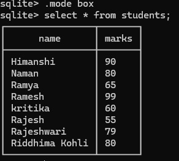
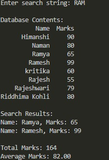

# Prework Assignment

### Directory Structure
```
prework/
│
├── assignment.db # SQLite database file
├── part2.py # Python script file
├── images/ # Folder containing images
└── README.md # README file
```


## Part 1: Creating a Database and Populating Data

### Database Creation and Table Schema

For this assignment, I used SQLite3 as the database.

1. **Creating the Database:**
   - Created a database named `assignment.db` using the command:
     ```sh
     sqlite3 assignment.db
     ```

2. **Table Creation:**
   - Created a table `students` with the following schema:
     ```sql
     CREATE TABLE students (
         name VARCHAR(255) PRIMARY KEY NOT NULL,
         marks INT NOT NULL
     );
     ```

3. **Data Insertion:**
   - Inserted multiple entries into the `students` table. Example:
     ```sql
     INSERT INTO students (name, marks) VALUES ('Shreya', 85);
     ```
   - Added a total of 8 such entries.

### Database Contents
##### Here is a screenshot of the database contents after insertion:


## Part 2: Writing the Python Script

### Python Script Description

The script connects to the SQLite3 database, performs a search, and displays the results. It also prints the database contents in a tabular format using pandas.

### Sample input by user
##### Result of the query:


